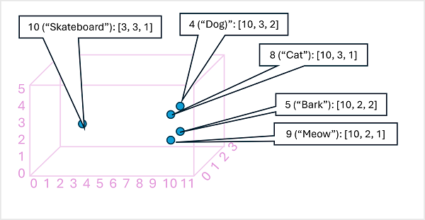
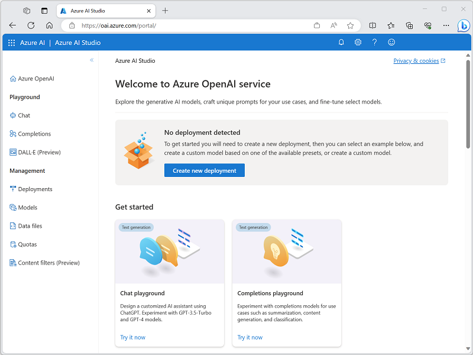
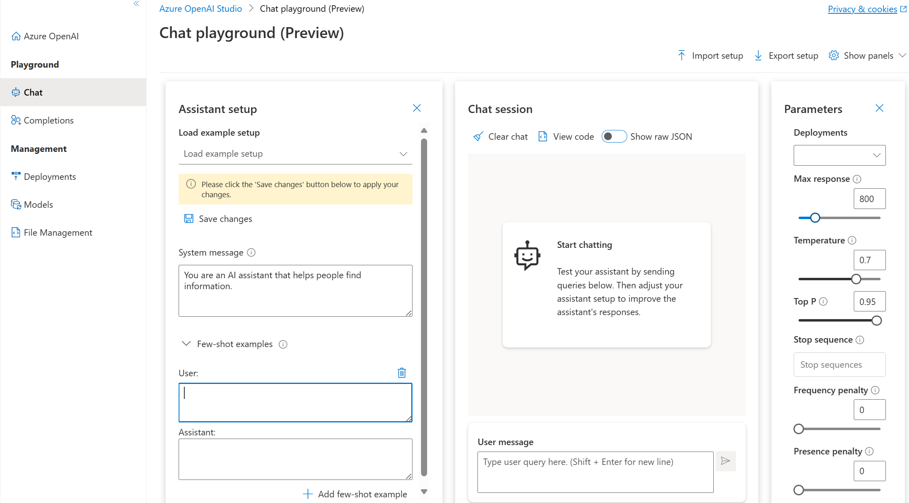
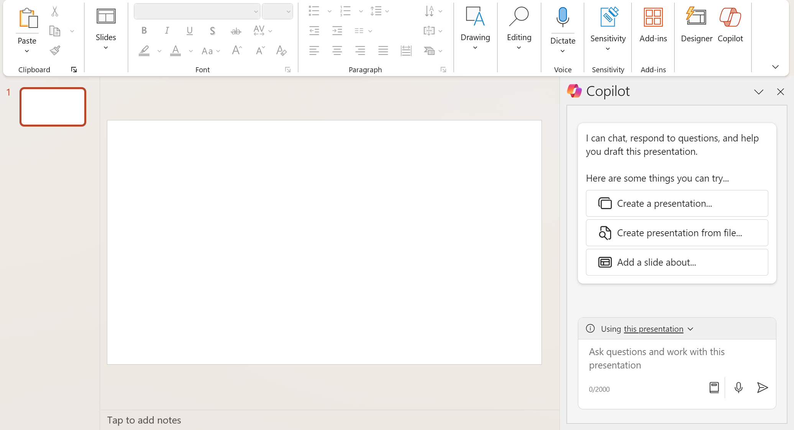

# 생성형 AI의 기초

## 목차
 - [소개](#소개)
 - [생성 AI란?](#생성-ai란)
 - [대규모 언어 모델](#대규모-언어-모델)
 - [Azure OpenAI란 무엇인가요?](#azure-openai란-무엇인가요)
 - [Copilot란?](#copilot란)
 - [프롬프트 엔지니어링을 사용하여 생성형 AI 응답 개선](#프롬프트-엔지니어링을-사용하여-생성형-ai-응답-개선)
 - [연습 - Microsoft Edge에서 Microsoft Copilot 살펴보기](#연습---microsoft-edge에서-microsoft-copilot-살펴보기)
 - [요약](#요약)
 - [출처](#출처)

---
## 소개
기술 역할로 근무하지 않거나 컴퓨터 과학 또는 기계 학습에 대한 배경 지식이 없는 사람들 사이에서도 생성형 AI 및 이를 구현하는 기술(예: ChatGPT)에 대한 대중 의식에 점점 더 증가하고 있습니다. 미래학자이자 소설가인 아서 Arthur C. Clarke는 “충분히 진보된 기술은 마법과 구별할 수 없다.”는 사실을 관찰한 것으로 인용됩니다. 생성형 AI의 경우 실제로 시, 산문, 심지어 컴퓨터 코드를 포함하여 인간과 같은 원본 콘텐츠를 생성하는 거의 기적적인 능력이 있는 것 같습니다.

그러나 생성형 AI와 관련된 마법은 없습니다. 통계, 데이터 과학 및 기계 학습에 대한 수년간의 연구를 통해 증분 방식으로 검색되고 구체화된 수학 기술의 적용일 뿐입니다. 이 모듈에서 살펴본 핵심 개념과 원칙을 학습하여 마법 속임수의 작동 방식에 대해 개략적으로 이해할 수 있습니다. 현재 사용 가능한 생성형 AI 기술에 대해 자세히 알아보면 사회가 미래 AI의 새로운 가능성을 상상하는 데 도움이 될 수 있습니다.

---
## 생성 AI란?
AI(인공 지능)는 기계 학습을 통해 환경과 상호 작용하고 출력할 내용에 대한 명시적 지침 없이 작업을 실행하여 인간 행동을 모방합니다.

생성형 AI는 원본 콘텐츠를 만드는 AI 내 기능 범주를 설명합니다. 사람은 일반적으로 채팅 애플리케이션에 기본 제공된 생성형 AI와 상호 작용합니다. 해당 애플리케이션의 인기 있는 예제 중 하나는 Microsoft와 긴밀하게 협력하는 AI 연구 회사인 OpenAI에서 만든 챗봇인 ChatGPT입니다.

생성형 AI 애플리케이션은 자연어 입력을 사용하고 자연어, 이미지 또는 코드와 같은 다양한 형식으로 적절한 응답을 반환합니다.

### 자연어 생성

자연어 응답을 생성하려면 “후추를 포함한 건강한 아침 식사에 대한 세 가지 아이디어 제시”와 같은 요청을 제출할 수 있습니다.

생성형 AI 애플리케이션은 다음과 같이 요청에 응답할 수 있습니다.

예. 후추를 포함하는 세 가지 건강한 아침 식사는 다음과 같습니다.

 1. 달걀 및 후추 스크램블: 피망을 깍뚝썰기 하고 팬에서 약간 부드러워질 때까지 볶습니다. 그런 다음, 풀어진 달걀을 추가하고 모든 것을 함께 휘저어서 스크램블을 만듭니다. 영양가 있는 아침 식사를 위해 통곡물 토스트와 함께 제공합니다.

 2. 후추 및 아보카도 토스트: 통곡물 빵 한 조각을 노릇하게 굽고 그 위에 얇게 썬 피망, 으깬 아보카도를 얹고 소금과 후추를 뿌립니다. 이는 후추의 비타민 C와 함께 아보카도의 몇 가지 건강한 지방을 섭취할 수 있는 좋은 방법입니다.

 3. 후추를 포함한 아침 식사 부리토: 얇게 썬 피망, 양파, 스크램블된 달걀을 팬에 함께 볶습니다. 그런 다음, 혼합 재료를 통곡물 토르티야에 숟가락으로 얹고 그 위에 살사 또는 핫 소스를 얹습니다. 둥글게 말아서 만족스럽고 영양가 있는 아침 식사를 즐기세요.

### 이미지 생성

일부 생성형 AI 애플리케이션은 자연어 요청을 해석하고 적절한 이미지를 생성할 수 있습니다. 예를 들어 “햄버거를 먹는 코끼리 이미지 만들기”와 같은 요청을 제출할 수 있습니다.

그런 다음, 생성형 AI 애플리케이션은 다음과 같이 제공한 설명에 따라 원래 새 이미지를 반환할 수 있습니다.


### 코드 생성

일부 생성형 AI 애플리케이션은 소프트웨어 개발자가 코드를 작성하는 데 도움이 되도록 설계됩니다. 예를 들어 “Python으로 tic-tac-toe 게임을 코딩하는 방법 표시”와 같은 요청을 제출하고 다음 응답을 생성할 수 있습니다.

예. Python의 Tic-Tac-Toe 게임에 대한 몇 가지 기본 코드는 다음과 같습니다.

```
board = [' ' for x in range(9)]  
  
def print_board():  
    row1 = '| {} | {} | {} |'.format(board[0], board[1], board[2])  
    row2 = '| {} | {} | {} |'.format(board[3], board[4], board[5])  
    row3 = '| {} | {} | {} |'.format(board[6], board[7], board[8])  
    print()  
    print(row1)  
    print(row2)  
    print(row3)  
    print()  
  
def player_move(icon):  
    if icon == 'X':  
        number = 1  
    elif icon == 'O':  
        number = 2  
    print('Your turn player {}'.format(number))  
    choice = int(input('Enter your move (1-9): ').strip())  
    if board[choice - 1] == ' ':  
        board[choice - 1] = icon  
    else:  
        print()  
        print('That space is taken!')  
  
def is_victory(icon):  
    if (board[0] == icon and board[1] == icon and board[2] == icon) or \  
       (board[3] == icon and board[4] == icon and board[5] == icon) or \  
       (board[6] == icon and board[7] == icon and board[8] == icon) or \  
       (board[0] == icon and board[3] == icon and board[6] == icon) or \  
       (board[1] == icon and board[4] == icon and board[7] == icon) or \  
       (board[2] == icon and board[5] == icon and board[8] == icon) or \  
       (board[0] == icon and board[4] == icon and board[8] == icon) or \  
       (board[2] == icon and board[4] == icon and board[6] == icon):  
        return True  
    else:  
        return False  
  
def is_draw():  
    if ' ' not in board:  
        return True  
    else:  
        return False  
  
while True:  
    print_board()  
    player_move('X')  
    print_board()  
    if is_victory('X'):  
        print('X Wins! Congratulations!')  
        break  
    elif is_draw():  
        print('The game is a draw!')  
        break  
    player_move('O')  
    if is_victory('O'):  
        print_board()  
        print('O Wins! Congratulations!')  
        break  
    elif is_draw():  
        print('The game is a draw!')  
        break
```

이는 게임의 기본 구현일 뿐이며 오류 처리 및 입력 유효성 검사와 같은 추가 기능을 통해 개선할 수 있습니다.

---
## 대규모 언어 모델

생성형 AI 애플리케이션은 다음을 포함하여 NLP(자연어 처리) 작업을 수행하는 데 사용할 수 있는 특수 유형의 기계 학습 모델인 LLM(대규모 언어 모델)을 기반으로 합니다.

 - 감정 확인 또는 텍스트 분류.
 - 텍스트 요약.
 - 여러 텍스트 원본의 의미 체계 유사성 비교.
 - 자연어 생성.

이러한 LLM의 기반이 되는 수학 원칙은 복잡할 수 있지만 이를 구현하는 데 사용되는 아키텍처에 대한 기본적인 이해는 작동 방식을 개념적으로 이해하는 데 도움이 될 수 있습니다.

### 변환기 모델

자연어 처리를 위한 기계 학습 모델은 수년 동안 발전했습니다. 오늘날 최첨단 대규모 언어 모델은 변환기 아키텍처를 기반으로 하며, 이 아키텍처는 NLP 작업을 지원하기 위해 어휘 모델링 및 특히 언어 생성에 성공한 것으로 입증된 일부 기술을 기반으로 빌드되고 이를 확장합니다. 변환기 모델은 대량의 텍스트로 학습되므로 단어 간의 의미 체계 관계를 나타내고 해당 관계를 사용하여 적합한 텍스트의 가능한 시퀀스를 결정할 수 있습니다. 충분히 큰 어휘를 포함하는 변환기 모델은 인간의 반응과 구별하기 어려운 언어 응답을 생성할 수 있습니다.

변환기 모델 아키텍처는 다음과 같은 두 가지 구성 요소 또는 블록으로 구성됩니다.

 - 학습 어휘의 의미 체계 표현을 만드는 인코더 블록.
 - 새 언어 시퀀스를 생성하는 디코더 블록.

실제로 아키텍처의 특정 구현은 다양합니다. 예를 들어 검색 엔진을 지원하기 위해 Google에서 개발한 BERT(Bidirectional Encoder Representations from Transformers) 모델은 인코더 블록만 사용하는 반면, OpenAI에서 개발한 GPT(생성형 사전 학습 트랜스포머) 모델은 디코더 블록만 사용합니다.

변환기 모델의 모든 측면에 대한 전체 설명은 이 모듈의 범위를 벗어나지만, 변환기의 일부 핵심 요소에 대한 설명은 생성형 AI를 지원하는 방법을 이해하는 데 도움이 될 수 있습니다.

#### 토큰화

변환기 모델을 학습시키는 첫 번째 단계는 학습 텍스트를 토큰으로 분해하는 것입니다. 즉, 각 고유 텍스트 값을 식별하는 것입니다. 간단히 설명하기 위해, 학습 텍스트의 각 불연속 단어를 토큰으로 생각할 수 있습니다(실제로는 부분 단어 또는 단어와 문장 부호의 조합에 대한 토큰을 생성할 수 있음).

예를 들어 다음 문장을 살펴봅니다.

I heard a dog bark loudly at a cat

이 텍스트를 토큰화하기 위해 각 불연속 단어를 식별하고 토큰 ID를 할당할 수 있습니다. 예를 들면 다음과 같습니다.

 - I(1)
 - heard(2)
 - a(3)
 - dog(4)
 - bark(5)
 - loudly(6)
 - at(7)
 - (“a”는 이미 3으로 토큰화됨)
 - cat(8)

이제 문장을 토큰으로 나타낼 수 있습니다. [1 2 3 4 5 6 7 3 8]. 마찬가지로 “I heard a cat”이라는 문장은 [1 2 3 8]로 표현될 수 있습니다.

모델을 계속 학습시키면 학습 텍스트의 각 새 토큰이 적절한 토큰 ID를 사용하여 어휘에 추가됩니다.

 - meow(9)
 - skateboard(10)
 - 등등...

충분히 큰 학습 텍스트 세트를 사용하면 수천 개 토큰의 어휘를 컴파일할 수 있습니다.

### 포함

토큰을 간단한 ID로 나타내는 것(기본적으로 어휘의 모든 단어에 대한 인덱스를 만드는 것)이 편리할 수 있지만 토큰은 단어의 의미 또는 단어 간 관계에 대해 아무 것도 알려 주지 않습니다. 토큰 간 의미 체계 관계를 캡슐화하는 어휘를 만들기 위해 포함이라고 하는 컨텍스트 벡터를 정의합니다. 벡터는 정보의 다중 값 숫자 표현입니다(예: 각 숫자 요소가 정보의 특정 특성을 나타내는 [10, 3, 1]). 언어 토큰의 경우 토큰 벡터의 각 요소는 토큰의 의미 속성을 나타냅니다. 언어 모델의 벡터 요소에 대한 특정 범주는 일반적으로 단어가 함께 또는 유사한 컨텍스트에서 사용되는 방식에 따라 학습 중에 결정됩니다.

각 토큰이 특정 “위치”를 차지하도록 토큰 포함 벡터의 요소를 다차원 공간의 좌표로 생각하면 유용할 수 있습니다. 토큰이 특정 차원을 따라 서로 더 가까울수록 의미 체계적 관련성이 높아집니다. 즉, 관련 단어가 함께 더 가깝게 그룹화됩니다. 간단한 예제로, 토큰에 대한 포함이 다음과 같은 세 가지 요소가 있는 벡터로 구성한다고 가정합니다.

 - 4("dog"): [10,3,2]
 - 5 ("bark"): [10,2,2]
 - 8(“cat“): [10,3,1]
 - 9(“meow“): [10,2,1]
 - 10(“skateboard“): [3,3,1]

다음과 같이 3차원 공간에서 이러한 벡터를 기반으로 토큰의 위치를 그릴 수 있습니다.



포함 공간에 있는 토큰의 위치에는 토큰이 서로 얼마나 가깝게 관련되는지에 대한 일부 정보가 포함됩니다. 예를 들어 “dog“의 토큰은 “cat“ 및 “bark“에 가깝습니다. “cat“ 및 “bark“의 토큰은 “meow“에 가깝습니다. “skateboard“의 토큰은 다른 토큰과 더 멀리 떨어져 있습니다.

```
이전 예제는 각 포함이 3차원만 있는 간단한 예제 모델을 보여줍니다. 실제 언어 모델에는 훨씬 더 많은 차원이 있습니다.
```

Word2Vec 또는 변환기 모델의 인코더 블록과 같은 언어 모델링 알고리즘을 포함하여 지정된 토큰 세트에 대한 적절한 포함을 계산할 수 있는 여러 가지 방법이 있습니다.

### Attention

변환기 모델의 인코더 및 디코더 블록에는 모델의 신경망을 형성하는 여러 계층이 포함됩니다. 이러한 모든 레이어에 대해 자세히 알아볼 필요는 없지만 두 블록에서 사용되는 레이어 유형 중 하나인 주의 계층을 고려하는 것이 유용합니다. 주의는 텍스트 토큰 시퀀스를 검토하고 해당 토큰 간 관계의 강도를 정량화하는 데 사용되는 기술입니다. 특히 자체 주의는 하나의 특정 토큰을 둘러싼 다른 토큰이 해당 토큰의 의미에 미치는 영향을 고려합니다.

인코더 블록에서 각 토큰은 컨텍스트에 따라 주의 깊게 검사되며 벡터 포함에 적절한 인코딩이 결정됩니다. 벡터 값은 토큰과 이 토큰이 자주 나타나는 다른 토큰 간 관계를 기반으로 합니다. 이 상황별 접근 방식은 동일한 단어가 사용되는 상황에 따라 여러 포함을 가질 수 있음을 의미합니다. 예를 들어 "the bark of a tree"는 "I heard a dog bark"와 다른 것을 의미합니다.

디코더 블록에서 주의 계층은 시퀀스의 다음 토큰을 예측하는 데 사용됩니다. 생성된 각 토큰의 경우 모델에는 해당 지점까지 토큰 시퀀스를 고려하는 주의 계층이 포함됩니다. 모델은 다음 토큰이 무엇이어야 하는지 고려할 때 가장 영향이 큰 토큰을 고려합니다. 예를 들어, "I heard a dog" 시퀀스가 주어지면 주의 계층은 시퀀스의 다음 단어를 고려할 때 "heard" 및 "dog" 토큰에 더 큰 가중치를 할당할 수 있습니다.

I heard a dog [bark]

주의 계층은 실제 텍스트가 아닌 토큰의 숫자 벡터 표현을 사용합니다. 디코더에서 프로세스는 완성되는 텍스트를 나타내는 토큰 포함 시퀀스로 시작합니다. 처음 발생하는 작업은 위치 인코딩 계층이 각 포함에 값을 추가하여 시퀀스에서 해당 위치를 나타내는 것입니다.

 - [1,5,6,2](I)
 - [2,9,3,1](heard)
 - [3,1,1,2](a)
 - [4,10,3,2](dog)

학습 중에 목표는 이전 토큰을 기반으로 시퀀스에서 마지막 토큰에 대한 벡터를 예측하는 것입니다. 주의 계층은 지금까지 시퀀스의 각 토큰에 숫자 가중치를 할당합니다. 이 값을 사용하여 다음 토큰에 대해 가능한 벡터를 계산하는 데 사용할 수 있는 주의 점수를 생성하는 가중치 벡터에 대한 계산을 수행합니다. 실제로 다중 헤드 주의라는 기술은 포함의 다양한 요소를 사용하여 여러 주의 점수를 계산합니다. 그런 다음, 신경망을 사용하여 가능한 모든 토큰을 평가하여 시퀀스를 계속할 가능성이 가장 큰 토큰을 결정합니다. 이 프로세스는 시퀀스의 각 토큰에 대해 반복적으로 계속되며, 지금까지 출력 시퀀스는 다음 반복에 대한 입력으로 회귀적으로 사용되어 기본적으로 출력 토큰을 한 번에 하나씩 빌드합니다.

다음 애니메이션은 이것이 어떻게 작동하는지에 대한 단순화된 표현을 보여줍니다. 실제로 주의 계층에서 수행되는 계산은 더 복잡합니다. 그러나 원칙은 다음과 같이 단순화할 수 있습니다.


1. 토큰 포함 시퀀스는 주의 계층에 공급됩니다. 각 토큰은 숫자 값의 벡터로 표현됩니다.
2. 디코더의 목표는 시퀀스의 다음 토큰을 예측하는 것이며, 이 토큰은 모델 어휘의 포함에 맞게 조정되는 벡터이기도 합니다.
3. 주의 계층은 지금까지 시퀀스를 평가하고 각 토큰에 가중치를 할당하여 이 토큰이 다음 토큰에 미치는 상대적 영향을 나타냅니다.
4. 가중치를 사용하여 주의 점수가 통해 다음 토큰에 대한 새 벡터를 계산할 수 있습니다. 다중 헤드 주의는 포함의 다양한 요소를 사용하여 여러 대체 토큰을 계산합니다.
5. 완전히 연결된 신경망은 계산된 벡터의 점수를 사용하여 전체 어휘에서 가능성이 가장 큰 토큰을 예측합니다.
6. 예측된 출력은 지금까지 시퀀스에 추가되어 다음 반복에 대한 입력으로 사용됩니다.

학습 중에 토큰의 실제 시퀀스를 알 수 있습니다. 시퀀스에서 현재 고려되는 토큰 위치보다 나중에 오는 토큰을 마스크합니다. 신경망에서와 마찬가지로 토큰 벡터의 예측 값은 시퀀스에 있는 다음 벡터의 실제 값과 비교되며 손실이 계산됩니다. 그런 다음, 손실을 줄이고 모델을 개선하도록 가중치를 증분 방식으로 조정합니다. 유추(새 토큰 시퀀스 예측)에 사용되는 경우 학습된 주의 계층은 지금까지 시퀀스에 맞게 의미 체계적으로 조정된 모델 어휘에서 가능성이 가장 큰 토큰을 예측하는 가중치를 적용합니다.

따라서 GPT-4(ChatGPT 및 Bing의 기반이 되는 모델)와 같은 변환기 모델은 텍스트 입력(프롬프트라고 함)을 사용하고 구문적으로 올바른 출력(완성이라고 함)을 생성하도록 설계되었습니다. 실제로 모델의 “마법“은 일관된 문장을 함께 묶을 수 있다는 것입니다. 이 능력은 모델 측의 "지식" 또는 "지능"을 의미하지 않습니다. 큰 어휘와 의미 있는 단어 시퀀스를 생성하는 능력입니다. 그러나 GPT-4와 같은 대규모 언어 모델을 매우 강력하게 만드는 것은 이 모델을 학습시킨 많은 데이터 양(인터넷의 퍼블릭 및 라이선스 데이터)과 네트워크의 복잡성입니다. 이를 통해 모델은 학습된 어휘의 단어 간 관계를 기반으로 하는 완성을 생성할 수 있습니다. 종종 동일한 프롬프트에 대한 인간의 대응과 구별할 수 없는 출력을 생성합니다.

---
## Azure OpenAI란 무엇인가요?

Azure OpenAI Service는 대규모 언어 모델을 배포, 사용자 지정 및 호스트하기 위한 Microsoft의 클라우드 솔루션입니다. 이 솔루션은 최고의 OpenAI 최첨단 모델 및 API를 Azure 클라우드 플랫폼의 보안 및 스케일링 성능과 결합합니다. Microsoft와 OpenAI의 파트너 관계를 통해 Azure OpenAI 사용자는 최신 언어 모델 혁신에 액세스할 수 있습니다.

Azure OpenAI는 다양한 요구 사항을 충족할 수 있는 많은 모델을 지원합니다. 해당 모델은 다음과 같습니다.

 - GPT-4 모델은 자연어 프롬프트를 기반으로 자연어 및 코드 완성을 생성할 수 있는 최신 세대의 GPT(Generative Pretrained Transformer) 모델입니다.
 - GPT 3.5 모델은 자연어 프롬프트를 기반으로 자연어 및 코드 완성을 생성할 수 있습니다. 특히 GPT-35-turbo 모델은 채팅 기반 상호 작용에 최적화되어 있으며 대부분의 생성 AI 시나리오에서 잘 작동합니다.
 - Embeddings 모델은 텍스트를 숫자 벡터로 변환하며 텍스트 원본의 유사성 비교와 같은 언어 분석 시나리오에서 유용합니다.
 - DALL-E 모델은 자연어 프롬프트를 기반으로 이미지를 생성하는 데 사용됩니다. 현재 DALL-E 모델은 미리 보기로 제공됩니다. DALL-E 모델은 Azure OpenAI Studio 인터페이스에 나열되지 않으며 명시적으로 배포할 필요가 없습니다.

모델은 속도, 비용 및 특정 작업을 완료하는 정도에 따라 다릅니다. Azure OpenAI Service 설명서에서 차이점 및 최신 모델에 대해 자세히 알아볼 수 있습니다.

대부분의 경우 모델을 있는 그대로 사용할 수 있습니다. 예를 들어 Azure OpenAI Service에서 GPT-4 모델을 배포하고 애플리케이션에서 즉시 사용할 수 있습니다. 그러나 기존 모델을 기본 모델로 사용할 수도 있습니다. 이 모델은 고유한 데이터를 사용하여 추가 학습을 위한 시작점입니다. 이 접근 방식을 미세 조정이라고 하며 이를 통해 미리 학습된 모델을 기반으로 빌드되지만 특정 시나리오와 관련된 데이터로 조정되는 사용자 지정 모델을 학습시킬 수 있습니다. 예를 들어 법률 회사는 기존 계약 및 기타 독점 법률 문서의 텍스트로 모델을 미세 조정하여 계약 콘텐츠 생성에 최적화된 모델을 학습시킬 수 있습니다.

### Azure OpenAI Studio

개발자는 AI 전문가가 Azure에서 생성형 AI 앱 개발을 지원하는 LLM을 배포, 테스트 및 관리할 수 있는 웹 기반 환경인 Azure OpenAI Studio에서 이러한 모델을 사용할 수 있습니다.



Azure OpenAI Studio 내에서 대규모 언어 모델을 배포하고, 몇 가지 예제를 제공하고, Azure OpenAI Studio의 채팅 플레이그라운드에서 테스트할 수 있습니다.


---
## Copilot란?
LLM의 가용성은 부조종사로 알려진 새로운 컴퓨팅 범주의 출현으로 이어졌습니다. Copilot는 종종 다른 애플리케이션에 통합되며 사용자가 생성형 AI 모델에서 일반적인 작업에 대한 도움을 받을 수 있는 방법을 제공합니다. Copilot는 일반적인 아키텍처를 기반으로 하므로 개발자는 다양한 비즈니스 관련 애플리케이션 및 서비스에 대한 사용자 지정 Copilot를 빌드할 수 있습니다.

예를 들어 Copilot가 파일 옆에 열리는 채팅 화면 기능으로 이미 사용하는 제품 내에 나타나는 것을 확인할 수 있습니다. 이 Copilot는 제품에서 생성되거나 검색되는 콘텐츠를 결과에 대한 특정 정보로 사용합니다.

대규모 언어 모델 생성이 Copilot 애플리케이션을 만드는 프로세스와 어떻게 관련되어 있는지 생각하는 것이 도움이 됩니다.

 1. 대규모 언어 모델을 학습시키는 데는 대용량 데이터가 사용됩니다.
 2. Azure OpenAI Service와 같은 서비스에서는 미리 학습된 모델을 사용할 수 있습니다. 개발자는 이 미리 학습된 모델을 있는 그대로 사용하거나 사용자 지정 데이터로 미세 조정할 수 있습니다.
 3. 모델을 배포하면 애플리케이션에서 사용할 수 있습니다.
 4. 개발자는 모델에 프롬프트를 제출하고 애플리케이션에서 사용할 콘텐츠를 생성하는 Copilot를 빌드할 수 있습니다.
 5. 비즈니스 사용자는 Copilot를 사용하여 AI 생성 콘텐츠로 생산성과 창의성을 높일 수 있습니다.

부조종사들은 첫 번째 초안, 정보 합성, 전략적 계획 등을 지원함으로써 우리가 일하는 방식에 혁명을 일으킬 수 있는 잠재력을 가지고 있습니다.

### Microsoft Copilot
이 이름은 copilot Microsoft에서 유래되었으며 업계 전반에서 자사 및 타사 부조종사에 대해 설명하는 데 사용됩니다. Microsoft는 Microsoft Copilot를 자사라고 하며 다른 회사에서 개발한 플러그 인을 타사 부조종사로 지칭합니다.

Microsoft Copilot 기능은 일반적으로 사용되는 애플리케이션 전체에서 찾을 수 있습니다. 이러한 기능의 목표는 사람들이 더 똑똑하고, 생산성이 높고, 창의적이며, 주변 사람들과 사물과 연결되도록 하는 것입니다.

예를 들어 Microsoft Copilot 를 Microsoft Bing 검색 엔진과 함께 사용하여 인덱싱된 페이지의 검색 결과가 아닌 컨텍스트에 따라 질문에 대한 자연어 답변을 생성할 수 있습니다.


또 다른 예로 Microsoft 365용 Microsoft Copilot가 있으며, PowerPoint 및 Outlook과 같은 생산성 및 통신 앱에서 함께 작동하여 효과적인 문서, 스프레드시트, 프레젠테이션, 전자 메일 등을 만들 수 있습니다.




또 다른 예로는 소프트웨어 개발자가 코드를 작성, 문서화 및 테스트할 수 있도록 지원하는 GitHub Copilot가 있습니다.


---
## 프롬프트 엔지니어링을 사용하여 생성형 AI 응답 개선
생성형 AI 애플리케이션이 반환하는 응답의 품질은 모델 자체뿐만 아니라 지정된 프롬프트 유형에 따라 달라집니다. 프롬프트 엔지니어링이라는 용어는 프롬프트 개선 프로세스를 설명합니다. 애플리케이션을 디자인하는 개발자와 해당 애플리케이션을 사용하는 소비자는 모두 프롬프트 엔지니어링을 고려하여 생성형 AI의 응답 품질을 개선할 수 있습니다.

프롬프트는 애플리케이션에 원하는 작업을 알리는 방법입니다. 엔지니어는 프롬프트를 사용하여 프로그램에 대한 지침을 추가할 수 있습니다. 예를 들어 개발자는 교사가 학생이 읽는 텍스트와 관련된 객관식 질문을 만들 수 있는 생성형 AI 애플리케이션을 빌드할 수 있습니다. 애플리케이션을 개발하는 동안 개발자는 프로그램이 수신하는 프롬프트를 사용하여 수행해야 하는 작업에 대한 다른 규칙을 추가할 수 있습니다.

### 시스템 메시지

프롬프트 엔지니어링 기술에는 시스템 메시지 정의가 포함됩니다. 이 메시지는 “쾌활하고 친숙한 방식으로 응답하는 유용한 도우미”와 같이 기대치 및 제약 조건을 설명하여 모델에 대한 컨텍스트를 설정합니다. 이러한 시스템 메시지는 모델의 응답에 대한 제약 조건 및 스타일을 결정합니다.

### 유용한 프롬프트 작성

“8월 중에 Edinburgh에서 수행할 10가지 작업 목록 만들기”와 같이 원하는 응답 종류를 명시하여 가장 유용한 완성을 얻을 수 있습니다. 명확하고 구체적인 프롬프트를 제출하면 더 나은 결과를 얻을 수 있습니다.

### 예제 제공

LLM은 일반적으로 이전 예제 없이 응답을 생성할 수 있는 제로샷(Zero-shot) 학습을 지원합니다. 그러나 “사람들이 도착하기 전에 아침에 성 방문”과 같이 필요한 출력의 하나 또는 몇 가지 예제를 포함하는 원샷(One-shot) 학습 프롬프트를 제공할 수도 있습니다. 그런 다음, 모델은 프롬프트에 제공된 예제와 동일한 스타일로 추가 응답을 생성할 수 있습니다.

### 기반 데이터

롬프트에는 컨텍스트를 제공하기 위한 기반 데이터가 포함될 수 있습니다. 기반 데이터를 프롬프트 엔지니어링 기술로 사용하여 사용자 지정 모델을 학습시키지 않고도 미세 조정의 많은 이점을 얻을 수 있습니다.

이 기술을 적용하려면 모델이 적절한 출력을 생성하는 데 사용할 수 있도록 프롬프트에 컨텍스트 데이터를 포함합니다. 예를 들어 LLM을 사용하여 메일의 요약을 생성하고자 한다고 가정해 봅니다. 프롬프트에 지침과 함께 메일 텍스트를 포함하여 요약할 수 있습니다.
---
## 연습 - Microsoft Edge에서 Microsoft Copilot 살펴보기

이제 Microsoft Copilot을 통해 생성형 AI를 살펴보겠습니다.

TODO : 실습자료 만들기
---
## 요약
이 모듈에서는 자연어 입력을 기반으로 새 콘텐츠를 만드는 인공 지능의 분기인 생성형 AI에 대해 알아보았습니다. 생성형 AI는 일반적으로 소프트웨어 애플리케이션에 기본 제공되며 대량의 텍스트 데이터로 학습된 언어 모델을 사용하여 인간과 유사한 자연어 응답 또는 원본 이미지를 생성합니다. 또한 대규모 언어 모델과 관련된 핵심 개념과 생성형 AI가 Copilot을 통해 Microsoft 기술에 통합되는 방법에 대해서도 알아보았습니다.

이 모듈의 기본 내용은 생성형 AI가 첫 번째 초안, 정보 합성 및 전략적 계획을 지원하여 작업 방식에 혁명을 일으킬 가능성이 있다는 것입니다. 대규모 언어 모델을 기반으로 하는 AI 기반 도우미인 Copilot은 다양한 비즈니스별 애플리케이션 및 서비스에 맞게 사용자 지정할 수 있습니다. 생성형 AI 애플리케이션이 반환하는 응답의 품질은 모델 자체뿐만 아니라 지정된 프롬프트 유형에 따라 달라집니다. 프롬프트 엔지니어링은 더 나은 결과를 생성하기 위해 프롬프트를 개선하는 프로세스입니다.

추가로 읽을 만한 내용:
 - [Microsoft AI Hub](https://learn.microsoft.com/ko-kr/ai/)
 - [Azure OpenAI 설명서](https://learn.microsoft.com/ko-kr/azure/ai-services/openai/overview)
 - [Azure OpenAI를 사용하여 AI 솔루션을 개발하는 방법 알아보기](https://learn.microsoft.com/ko-kr/training/paths/develop-ai-solutions-azure-openai/)

---
## 출처
[Microsoft learn 생성형 AI의 기초](https://learn.microsoft.com/ko-kr/training/modules/fundamentals-generative-ai/)